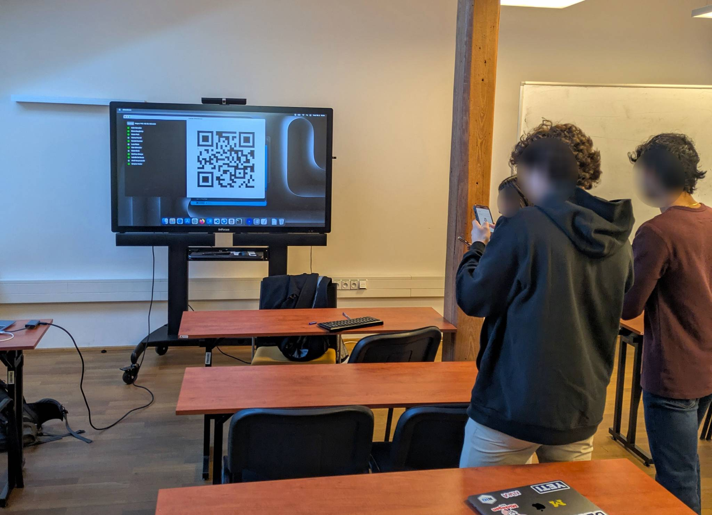
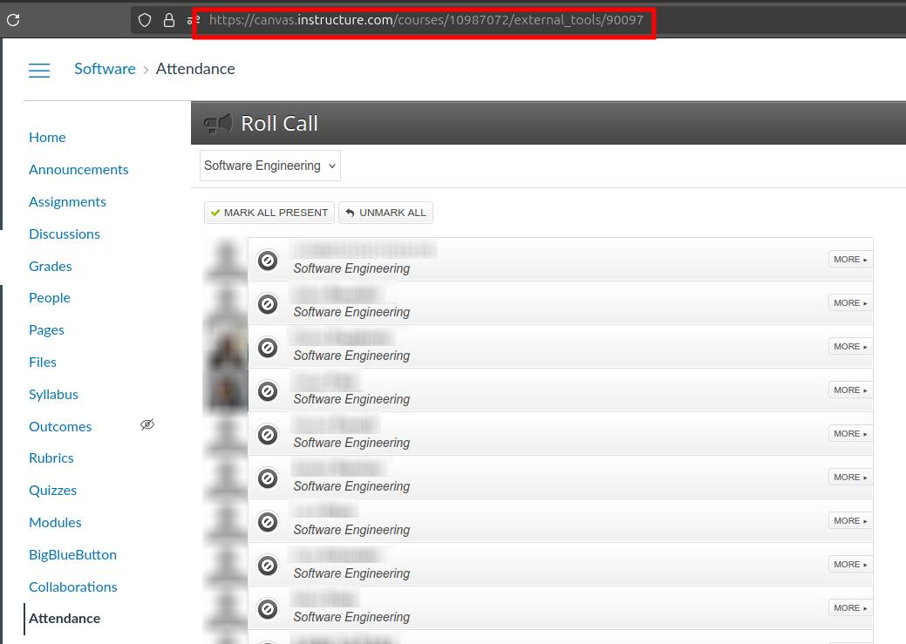
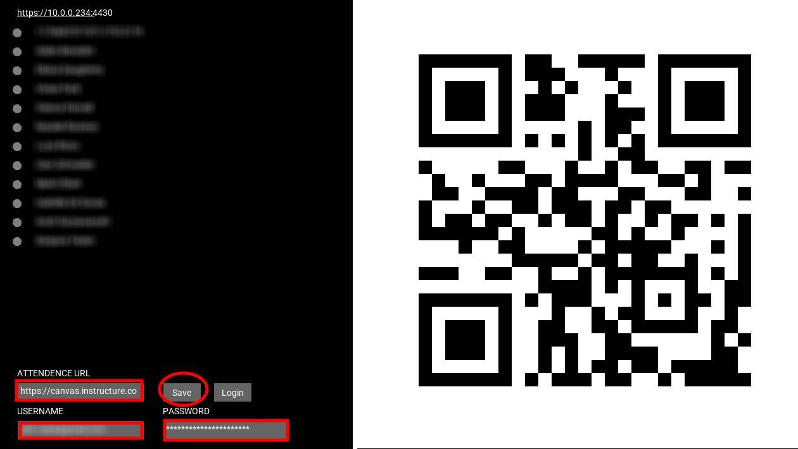
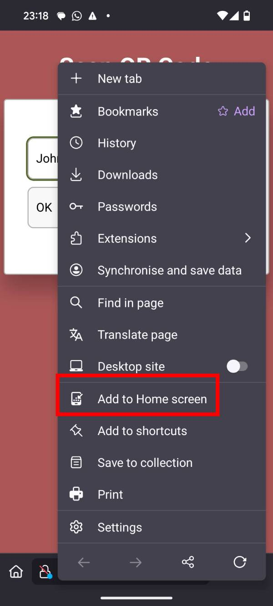
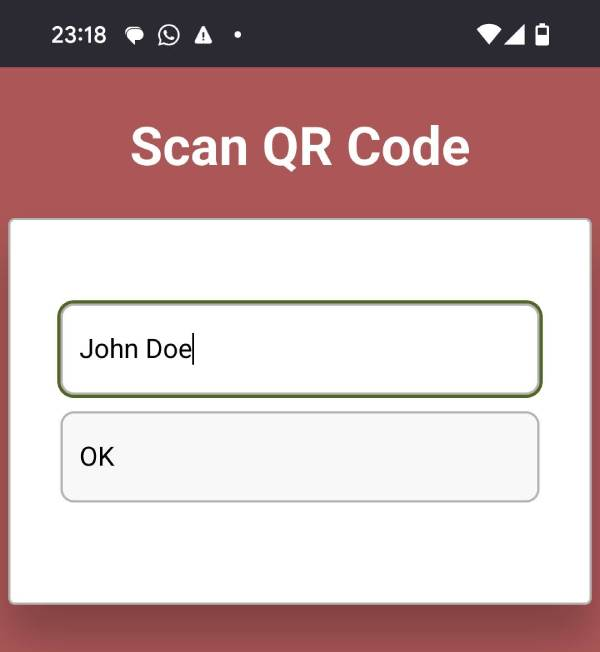

# QR Code Attendance Automation for Canvas Roll Call

This project automates the attendance tracking with QR codes for the  [Canvas](https://www.instructure.com/) [Roll Call](https://community.canvaslms.com/t5/Instructor-Guide/How-do-I-use-the-Roll-Call-Attendance-tool-in-a-course/ta-p/1003). 

## Problem Background
Canvas uses the Roll Call plugin to track attendance, but unfortunately, this plugin does not have an API. So before the teacher need to manually mark each student present or absent. To overcome this, this Java application utilizes **Selenium** and **Ungoogled Chromium** in headless mode to interact with Canvas's Roll Call Attendance system. It interacts with the website as you would normally did (ie clicks on web elements identified via Xpath) and let students to scan the QR themselves. In essence it outsources the need to mark attendance from teacher to students. Single teacher can forget to mark attendance or do a mistake but students are more motivated to mark themselves, plus they can remind it to each other.

## Overview of the Solution
This Java application runs on your PC and serves an asynchronous HTTPS server using a **self-signed certificate**. The server runs on port **4430**.

Once the server is running, the application generates a **QR code** that points to the local server. Students can scan the QR code to mark themselves as present. 

### Requirements
- **Canvas teacher credentials**: You will need your Canvas username and password.
- **Canvas Attendance URL**: The URL of the page with the Roll Call attendance feature for your class.

### Installation ###
[Download latest release](https://github.com/trackme518/attendence_canvas/releases/latest). Unzip it. the App is packaged with all binaries so no further installation is needed, all dependencies are included.

**Linux**
- In case you need to install 7zip -> from [source](https://www.7-zip.org/download.html), or on Ubuntu: `sudo apt install p7zip-full p7zip-rar`
- Enable 4430 port in your firewall. In terminal run `sudo ufw allow 4430/tcp`
- Mark executable `chrome.AppImage` and `chromedriver` in `attendence/data/chromedriver/linux64/` - on Ubuntu you can right-click->Properties->Executable as Program or in terminal `chmod a+x chrome.AppImage`
- On Ubuntu, to use the .AppImage you may need to install `sudo apt install libfuse2` (can coexist with libfuse3)

**MacOS**
- Allow the app in Privacy & Security one by one as needed. To allow all programs from Everywhere (and get rid of this problem for good), follow the [tutorial](https://macpaw.com/how-to/allow-apps-anywhere).
- You might need to run command `xattr -r -d com.apple.quarantine attendence` on the attendence directory to remove quarantine flag (downloaded from internet).

**Windows**
- unzip .7zip, double click .exe, choose Allow when prompted for network Access. 
- You might need to enable port 4430 in firewall - [tutorial](https://learn.microsoft.com/en-us/sql/reporting-services/report-server/configure-a-firewall-for-report-server-access?view=sql-server-ver16)

### Screenshot of Canvas Attendance Page

### Screenshot of App Settings

## How to Use
Intended use: Enter the classroom, open your PC, run the program - let students scan the QR code. Lave the program running in the background while you continue with your lesson. At the end of the lesson, close the app. 

### 1. Set Up the Application
After launching the app, you will need to provide the following:
- **Canvas URL**: The URL of the Canvas attendance page.
- **Canvas Username**: Your Canvas login username.
- **Canvas Password**: Your Canvas login password.
- **Connect to school WiFi**: You need to be connected to local WiFi that students have acces to - students connect locally to your PC.

These can be entered directly into the app as shown in the screenshot above. Then let the app load and show your students the QR code - they can scan it with their phone. 

### 2. Save the Credentials
Once you have entered the necessary information (URL, username, and password), click **Save**. You can copy-paste your data with CTRL+V. The app will remember these settings for the future. 

- **Note**: You will need to log in only once. The next time you start the app, it will automatically load the credentials and log you in.

### 3. Login and Load Attendance
When you start the app, it will try to log in, which may take up to 10 seconds. Let the app complete this process. 

While the app is working in the background, you will see three animated dots at the top of the screen, indicating that it is running.

### 4. Loading Students
Once logged in, the app will fetch all student names from the Canvas attendance page. The names will be displayed next to grey circles.

### 5. QR Code Generation
The app will generate a QR code that points to a **local web address** on your PC. This web page is served by the local server running on port **4430**. 

Students can scan the QR code using their mobile phones. The web page will allow them to enter their name (their  name will be saved persistently in their browser).

### 6. Marking Attendance
Once the students have entered their name, they can scan the QR code again, and the app will automatically mark them as present - the grey circle next to their name will turn green. 

#### Late attendance

* If the student scan QR code 15+ minutes later after the app was started it will mark them as late, later than 60+ minutes as absent. The timeout periods can be set manually inside data.json once you save your credentials inside the data folder of the App (default 15min late, 60 min absence).
* After 60 minutes that the program was running it will automatically mark absence to all students that did not mark themselves as present (you can simply close the program to prevent this).

### 7. Progressive Web App (PWA)
Students can save the web page as a Progressive Web App (PWA) to their phone's homepage for easier access. This way, they can quickly mark themselves present every time.
The **name provided need to match the Canvas name**! So if instead of name, someone has a number the number needs to be submitted. To save the website to phone's homepage click options in browser and select **Add to Home screen**. 
See screenshot below:

The succesful presence noted:

## Conclusion
This solution automates the attendance process for Canvas using QR codes, making it easier and faster for students to mark their attendance. It also eliminates the need for manual entry by teachers.

## Cheating
To prevent cheating I am **tracking request IP address**. Each time the student mark themself present it will note their IP - if the IP is same as the other student, the **other student will be unmarked!**. 
To further discourage cheating I am also tracking unique videoinput device id (ie phone's camera) and use it same way as IP - any IP / videoinput id can not be the same as other student's. 

## Architecture
I am using [Java Processing](https://processing.org/) - uses Java 17, [Selenium](https://www.selenium.dev/downloads/) and [ungoogled-chromium](https://github.com/ungoogled-software/ungoogled-chromium). 
In particular I am using Selenium 4.28.1 for Java, January 23, 2025 - with Ungoogled Chromium 133 (I use Chrome for Testing for Windows64 and Unggogled Chromium on Linux and MacOS which is just easier to package). If you update the chromium it likely breaks as the Selenium expects certain version of the driver to go along with it, however both Ungoogle Chromium and Chrome for testing should not update on their own.   

## Download
Download the latest build from Releases.  

## Like it?
Please star the repo :-).

## Warning
Your Canvas password and username is saved inside the App - it is assumed it is running on your PC only. Take care of securing your PC to prevent leak. 

## Licence
You can download the release for non-commercial, personal use. If you want to deploy in your ogranization please contact me for licencing. 

 
<a property="dct:title" rel="cc:attributionURL" href="https://github.com/trackme518/attendence_canvas"> QR Code Attendance Automation for Canvas Roll Call</a> by Vojtech Leischner is licensed under <a href="https://creativecommons.org/licenses/by-nc-nd/4.0/?ref=chooser-v1" target="_blank" rel="license noopener noreferrer" style="display:inline-block;">CC BY-NC-ND 4.0</a>
 

 ## Disclaimer
THIS SOFTWARE IS PROVIDED BY THE COPYRIGHT HOLDERS AND CONTRIBUTORS “AS IS” AND ANY EXPRESS OR IMPLIED WARRANTIES, INCLUDING, BUT NOT LIMITED TO, THE IMPLIED WARRANTIES OF MERCHANTABILITY AND FITNESS FOR A PARTICULAR PURPOSE ARE DISCLAIMED. IN NO EVENT SHALL THE COPYRIGHT OWNER OR CONTRIBUTORS BE LIABLE FOR ANY DIRECT, INDIRECT, INCIDENTAL, SPECIAL, EXEMPLARY, OR CONSEQUENTIAL DAMAGES (INCLUDING, BUT NOT LIMITED TO, PROCUREMENT OF SUBSTITUTE GOODS OR SERVICES; LOSS OF USE, DATA, OR PROFITS; OR BUSINESS INTERRUPTION) HOWEVER CAUSED AND ON ANY THEORY OF LIABILITY, WHETHER IN CONTRACT, STRICT LIABILITY, OR TORT (INCLUDING NEGLIGENCE OR OTHERWISE) ARISING IN ANY WAY OUT OF THE USE OF THIS SOFTWARE, EVEN IF ADVISED OF THE POSSIBILITY OF SUCH DAMAGE.

